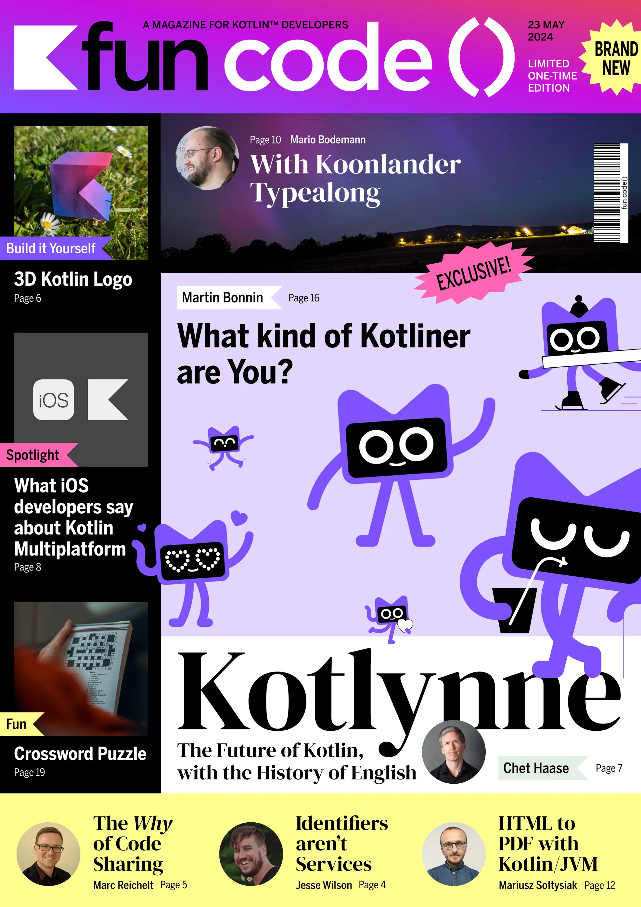

# fun code() – A magazine for Kotlin™ developers

Launched on May 23rd, 2024 in time for [KotlinConf 2024](https://kotlinconf.com/).

## 🎉 Download as PDF 🎉

[Download the PDF here](releases/1.0.0/fun%20code%28%29%20Magazine%201.0.0.pdf) and read it online or print it to hold it in your hands!

More variants - as for professional printing - can be found here:
[Latest Release (1.0.0)](https://github.com/kotlin-magazine/kotlin-magazine/releases/tag/1.0.0)

## Follow us

Follow us on [Twitter](https://x.com/funcode_mag) and [Mastodon](https://mastodon.social/@funcode_mag)! We're looking forward to chatting with you!

Also: if you happen to be at KotlinConf 2024 in Copenhagen, just find us at the conference! 🙌

## History

It started out as a cover of an imaginary "Kotlin Today Magazine" as an April's fools on April 1st, 2024, on [kotlintoday.com](https://kotlintoday.com/):

Then we created a real one - with real content, and changed the name to "fun code()" 🤯

## Legal stuff

This magazine is not associated with the Kotlin Foundation or KotlinConf. Kotlin™ is a trademark of the Kotlin Foundation. Java™ and OpenJDK™ are trademarks of Oracle and/or its affiliates.
