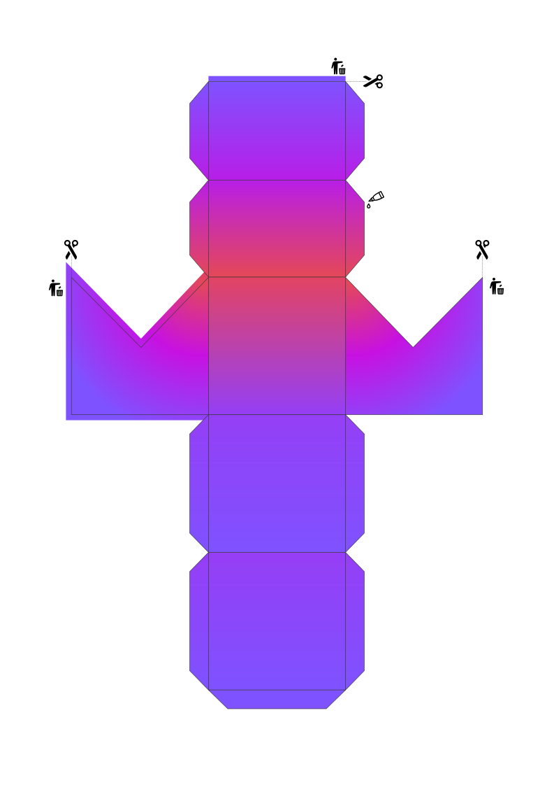

# Kotlin 3D do-it-yourself

A 3D Kotlin Logo do-it-yourself style!

## How-to

You'll need scissors and glue, and a printer if you didn't already get a printed version.

1. Print it out on A4 paper
2. Cut at the marked lines
3. Fold at the inner lines
4. Put glue on flaps
5. Glue together
6. Enjoy Kotlin - now in 3D 🎉
